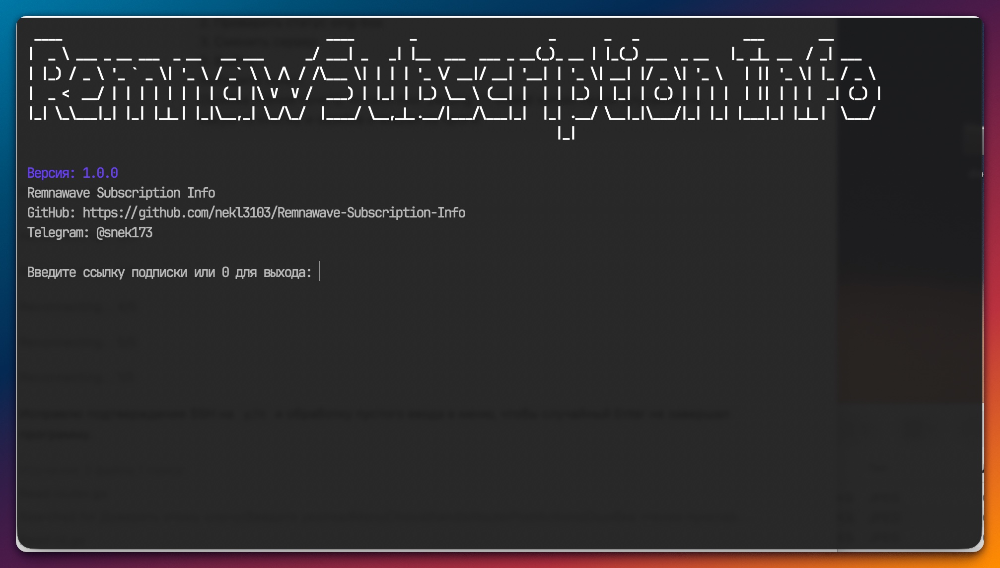

# Remnawave Subscription Info

Программа для просмотра серверов из ссылки подписки Remnawave и настройки `sing-box` на роутере OpenWrt.



## Что умеет

| Информация о серверах | Работа с роутером |
| --- | --- |
| - Запрашивает ссылку подписки.<br>- Показывает список серверов.<br>- Показывает и вручную обновляет пинг выбранного сервера в ms.<br>- Поддерживает VLESS, Shadowsocks, Trojan и Hysteria2. VMess поддерживается для чтения из подписок.<br>- Показывает детальную информацию выбранного сервера.<br>- Поддерживает поиск, фильтр серверов и обновление списка из подписки.<br>- Экспортирует готовый `outbounds` в JSON файл.<br>- Генерирует готовый `outbounds` для `sing-box`. | - Подключается к роутеру по SSH.<br>- Запоминает SSH адрес и пароль роутера на время текущего запуска.<br>- Обновляет `/etc/sing-box/config.json`.<br>- Создает timestamp backup `/etc/sing-box/config.json.bak.YYYYMMDD-HHMMSS` и восстанавливает последний backup.<br>- Перезапускает `sing-box`.<br>- Показывает статус `sing-box`.<br>- Показывает логи `sing-box` в реальном времени.<br>- Позволяет сбросить сохраненные SSH данные текущего запуска. |

## Скачать

Скачайте файл для своей системы в разделе GitHub Releases:

- macOS Intel: `terminal-macos-intel.tar.gz`
- macOS Apple Silicon / Mac M1/M2/M3: `terminal-macos-apple-silicon.tar.gz`
- Linux 64-bit: `terminal-linux-amd64.tar.gz`
- Windows 64-bit: `terminal-windows-amd64.exe.zip`

## Запуск

### macOS и Linux

Распакуйте архив, откройте терминал в папке с программой и выполните:

```bash
chmod +x terminal-*
./terminal-linux-amd64
```

На macOS имя файла будет `terminal-macos-intel` или `terminal-macos-apple-silicon`.

### Windows

Распакуйте `.zip` архив и запустите:

```powershell
terminal-windows-amd64.exe
```

## Как пользоваться

1. Запустите программу.
2. Вставьте ссылку подписки, например:

```text
https://example.com/subscription-link
```

3. Выберите сервер из списка.
4. После выбора сервера можно:
   - посмотреть детальную информацию;
   - показать настройки для `sing-box`;
   - записать сервер на роутер;
   - посмотреть логи `sing-box`;
   - проверить статус `sing-box`;
   - сделать или восстановить backup конфига;
   - найти сервер или отфильтровать список по протоколу;
   - обновить список серверов из подписки;
   - проверить пинг выбранного сервера;
   - экспортировать `outbounds` в файл;
   - сбросить сохраненные SSH данные;
   - сменить сервер;
   - выйти из программы.

## Настройка роутера

При выборе пункта `Установить на роутер` программа спросит SSH адрес роутера:

```text
Введите SSH адрес роутера или нажмите Enter для root@192.168.1.1:
```

Если адрес стандартный, просто нажмите Enter.

Дальше введите пароль от роутера. Программа подключится по SSH и обновит файл:

```text
/etc/sing-box/config.json
```

Перед изменением создается timestamp backup:

```text
/etc/sing-box/config.json.bak.YYYYMMDD-HHMMSS
```

Программа обновляет только outbound с `tag: "proxy"` и не удаляет остальные outbounds. После успешного сохранения программа перезапустит `sing-box`. Восстановление использует самый свежий backup и поддерживает старый файл `/etc/sing-box/config.json.bak`, если timestamp backup еще не создавался.

При первом SSH-подключении к роутеру программа покажет fingerprint host key и попросит подтвердить доверие вводом `yes`. После подтверждения ключ сохраняется в пользовательском конфиге приложения и проверяется при следующих подключениях.

После первого успешного подключения SSH адрес и пароль сохраняются только в памяти программы. Пока программа открыта, повторно вводить пароль для логов, статуса, backup или записи конфига не нужно. После перезапуска программы пароль снова нужно ввести вручную.

## Сборка из исходников

Нужен Go.

```bash
go test ./...
go build .
```

## Релизные сборки

Сборки создаются автоматически через GitHub Actions при пуше тега:

```bash
git tag v1.0.0
git push origin v1.0.0
```

После этого в GitHub Releases появятся архивы для macOS, Linux и Windows 64-bit.
